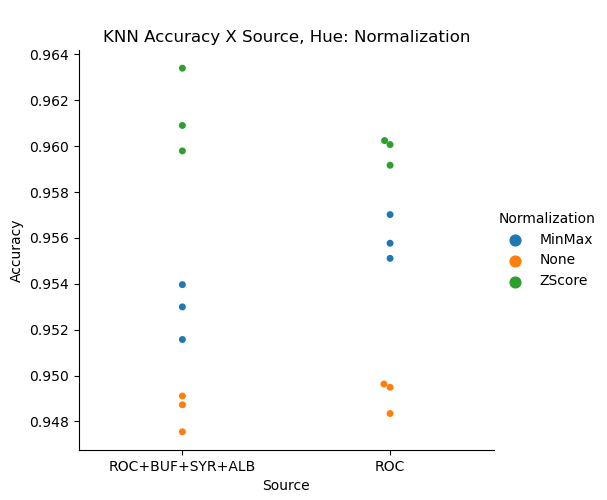
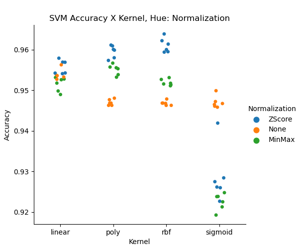
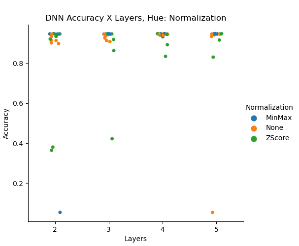
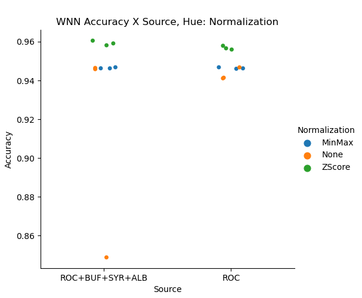

# ANNSIM21 Project

KNN, An Underestimated Model For Regional Rainfall Forecasting

## Repository Preface

There is a Python command line interface for the pretrained models, ModelInterface.py.
Run ModelInterface.py --help to see available options. The pretrained models are too large for this repository so they are stored at: [https://www.itss.brockport.edu/~nyu/models/models.zip](https://www.itss.brockport.edu/~nyu/models/models.zip)

Simply download the archive to the top level of this repository and unzip to be able to use the ModelInterface.

## Setup

The datasets tested with each of the AI methods below are a cross of Source, Normalization Method, and Random State for train/test split.

The Sources for the data were weather station data from [Iowa State Mesonet Automated Surface Observing System (ASOS)](https://mesonet.agron.iastate.edu/ASOS/). There were two sets of weather stations that were considered; Rochester alone and Rochester along with 2 stations averaged from each of Buffalo, Syracuse, and Albany. In both cases, the data was averaged to the hour starting from January 1, 2010 to December 31, 2020.

The Normalization methods considered were MinMax, ZScore, and no normalization.

### For all of the Following AI

The method to split the data into a training set and testing set was the train_test_split() from SKLearn that used a given random state to randomly split the data. The random states that were considered were None, 0, and 42. The only AI that did not use these random states was LSTM as it relied on sequential data. For all AI methods, the train/test ratio was 70/30. The reason for choosing each of the Random States was; for None to see training without shuffling, for 0 as a simple base for shuffing, and for 42 the reason was that it is a common choice and comes from the Novel Hitchhiker's Guide to the Galaxy.

Their analysis plots are all located in the plots folder under the AI's respective name. The folders are split once more for the two batches of data that were used.

The plots are dot plots to show the distribution of Accuracy separated by the different elements of each iteration. Each of those plots also has a coloring to show a third categorical value. Considering that there are more than Three categories of interest there are many plots to show every relationship

### KNN (K-Nearest Neighbor) from [SKLearn](https://scikit-learn.org/stable/about.html#citing-scikit-learn)
There were 25 iterations of fitting to a KNeighborClassifier to find the best nneighbors value for each of the data made from crossing the 2 Sources, 2 Normalization Methods, and 3 Random States for a total of 450(2x2x3x25) unique KNeighborClassifiers.

The best accuracy for KNN was 96.34% obtained from the ROC+BUF+SYR+ALB, normalized with ZScore, using None as Random State and n_neighbors of 11.

For KNN, there was additional Scatterplots for Accuracy against NNeighbors that also are colored by some third category.

Here is a notable plot for KNN:

This plot is showing how the 2 different Sources faired in terms of accuracy and it also shows the different Normalization methods using colored points.

All the KNN plots were made using data from [knn.log.csv](logs/knn.log.csv)

### SVM (Support Vector Machine) from [SKLearn](https://scikit-learn.org/stable/about.html#citing-scikit-learn)

There were 72 unique Support Vector Machine Classifiers by training against the cross of 2 Sources, 3 Normalization methods, 4 Kernels, and 3 Random States.

The best accuracy for SVM was 96.39% obtained from the ROC+BUF+SYR+ALB, normalized with ZScore, using None as Random State and the rbf kernel.

Here is a notable SVM plot:

This plot is showing how the different kernels faired in terms of accuracy, and it also shows the different normalization methods using colored points.

All the SVM plots were made using data from [svm.log.csv](logs/svm.log.csv)

### RCC (Reservoir Computer Classifier) from [Nolan J. Coble](https://github.com/nolanjcoble/reservoir_computing_classifier)

There were 54 unique RCC's by training against the cross of 2 Sources, 3 Normalization methods, 6 Reservoir sizes(50, 100, 200, 400, 600, 1000), and 3 Random States.

The best accuracy for RCC was 95.88% obtained from the ROC, normalized with ZScore, using None as Random State and with a reservoir size of 1000.

Here is a notable RCC plot:

This plot is showing how the different reservoir sizes faired in terms of accuracy and it also shows the different Normalization Methods using colored points.

All the DNN plots were made using data from [rcc.log.csv](logs/rcc.log.csv)

### DNN (Deep Neural Network) from [Tensorflow](https://www.tensorflow.org/)

There were 72 unique DNN Classifiers by training against the cross of 2 Sources, 3 Normalization methods, 4 different amounts of hidden layers, and 3 Random States. The 4 different hidden layers were; 2 layers, 3 layers, 4 layers, and 5 layers. Each of the hidden layers had the number of inputs equal to the number of features which for the ROC datasets was 9 and for the ROC+BUF+SYR+ALB there were 36 inputs at each hidden layer.

The best accuracy for DNN was 94.88% obtained from the ROC+BUF+SYR+ALB, normalized with ZScore, using None as Random State and with 5 hidden layers.

Here is a notable DNN plot:

This plot is showing how the different number of hidden layers faired in terms of accuracy and it also shows the different normalization methods using colored points.

All the DNN plots were made using data from [dnn.log.csv](logs/dnn.log.csv)

### WNN (Wide Neural Network) from [Tensorflow](https://www.tensorflow.org/)

There were 18 unique WNN Classifiers by training against the cross of 2 Sources, 3 Normalization methods, and 3 Random States.

The best accuracy for WNN was 96.06% obtained from the ROC+BUF+SYR+ALB, normalized with ZScore, using None as Random State.

Here is a notable WNN plot:

This plot is showing how the different Sources faired in terms of accuracy and it also shows the different Normalization Methods using colored points.

All the WNN plots were made using data from [wnn.log.csv](logs/wnn.log.csv)

### DWNN (Deep + Wide Neural Network) from [Tensorflow](https://www.tensorflow.org/)

There were 72 unique DWNN Classifiers by training against the cross of 2 Sources, 3 Normalization methods, 4 different amounts of hidden layers for the deep aspect, and 3 Random States. The 4 different hidden layers were; 2 layers, 3 layers, 4 layers, and 5 layers. Each of the hidden layers had the number of inputs equal to the number of features which for the ROC datasets was 9 and for the ROC+BUF+SYR+ALB there were 36 inputs at each hidden layer.

The best accuracy for DWNN was 95.91% obtained from the ROC+BUF+SYR+ALB, normalized with ZScore, using None as Random State and with 4 hidden layers.

Here is a notable DWNN plot:

This plot is showing how the different number of hidden layers for the deep part of DWNN faired in terms of accuracy and it also shows the different normalization methods using colored points.

All the DNN plots were made using data from [dwnn.log.csv](logs/dwnn.log.csv)

### LSTM (Long-Short Term Memory) from [Tensorflow](https://www.tensorflow.org/)

There were 12 unique LSTM Classifiers by training against the corss of 2 Sources, 3 Normalization Methods, and 2 different sequence lengths. The two sequence lengths considers were 3 previous rows of data and 7 previous rows of data.

The best accuracy for LSTM was 94.82% obtained from the ROC+BUF+SYR+ALB, normalized with MinMax, using a sequence length of 3.

Here is a notable LSTM plot:

This plot is showing how the different Sequnce Lengths faired in terms of accuracy and it also shows the different normalization methods using colored points.

All the LSTM plots were made using data from [lstm.log.csv](logs/lstm.log.csv)

## Results

The final result was SVM's best accuracy beat out all the others with 96.39% obtained from the ROC+BUF+SYR+ALB, normalized with ZScore, using None as Random State and the rbf kernel.

Here is another look at the results with the added dimension of Normalization used.

## Feature Definitions

tmpf:
Air Temperature in Fahrenheit, typically @ 2 meters

dwpf:
Dew Point Temperature in Fahrenheit, typically @ 2 meters

relh:
Relative Humidity in %

drct:
Wind Direction in degrees from north

sknt:
Wind Speed in knots

p01i:
One hour precipitation for the period from the observation time to the time of the previous hourly precipitation reset. This varies slightly by site. Values are in inches. This value may or may not contain frozen precipitation melted by some device on the sensor or estimated by some other means. Unfortunately, we do not know of an authoritative database denoting which station has which sensor.

alti:
Pressure altimeter in inches

mslp:
Sea Level Pressure in millibar

vsby:
Visibility in miles
